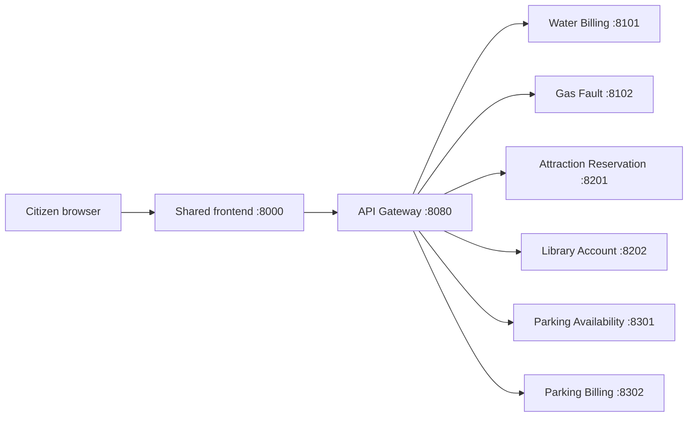

# ServiceUniverse architecture

## 1. Service and microservice terminology

The course lecture *Service-oriented architectural patterns — Microservices*
distinguishes the two concepts:

- A software service is accessed remotely through a published interface while its
  implementation is hidden.
- A microservice is additionally small-scale, focused on a single responsibility,
  self-contained, independently deployable, and responsible for its own data.
- A good microservice has high cohesion, low coupling, lightweight communication,
  and represents a business capability.

ServiceUniverse therefore uses this explicit interpretation:

1. The platform contains **six business services**. All six have executable code and
   a published HTTP interface.
2. Exactly **three selected services receive full microservice treatment** for Part E:
   Water Billing, Attraction Reservation, and Parking Availability.
3. The other three services remain executable business services but may use a
   simpler implementation and deployment design.

Running all six services as separate processes in the development Compose file is
an integration convenience. It is not, by itself, a claim that all six satisfy the
full microservice design criteria.

## 2. Selected microservice acceptance criteria

The three selected microservices must each have:

- one clearly bounded business capability;
- an independent application configuration;
- an independent database or data store;
- no imports from another service;
- no access to another service's database;
- a service-local Dockerfile and dependency declaration before final delivery;
- health checks and automated tests;
- a documented API contract;
- the ability to build, start, stop, test, and demonstrate independently;
- service-specific UI management code integrated into the shared frontend shell.

## 3. Runtime structure

The browser calls only the Gateway for business data. Service ports remain exposed
in the starter solely for development, API inspection, and independent testing.

## 4. Communication decisions

- External style: REST over HTTP with JSON representations.
- Current interaction: synchronous request/response.
- Coordination: the Gateway provides the public entry point and common error
  handling; it does not contain business logic.
- Address discovery: environment variables.
- Request tracing: `X-Request-ID`.
- Failure behaviour: explicit timeouts and unified `502`, `503`, or `504` errors.
- Shared database access: prohibited.

Asynchronous messaging or a message broker should be added only if a concrete
workflow requires it. It is not required merely to make the architecture look more
complex.

## 5. Source-of-truth files

- `contracts/catalog.json`: provider names, service names, slugs, owners, ports,
  and selected-microservice labels.
- `API_CONVENTION.md`: platform-wide HTTP and JSON rules.
- `contracts/schemas/`: service-specific OpenAPI or JSON Schema contracts.
- `.env.example`: host-development addresses.
- `compose.yaml`: container-development addresses and startup graph.

Changing a slug, port, field, status, or activity name requires updating its source
of truth first and documenting the impact in the pull request.

## 6. Shared frontend ownership

The frontend provides a single civic identity, navigation system, accessibility
baseline, and error language. A service owner edits only:

- `frontend/templates/services/<service-slug>.html`;
- optional service-specific CSS or JavaScript;
- tests for that service view.

Shared templates and `frontend/static/css/site.css` remain Leader-owned. This
prevents each service from becoming a visually unrelated mini-site.

## 7. Development image versus final deployment

The root `Dockerfile` is a common development image so a new contributor can launch
the entire skeleton immediately. Before final delivery, each selected microservice
must gain its own Dockerfile and dependency boundary. That later step demonstrates
independent deployability without making initial collaboration unnecessarily hard.
