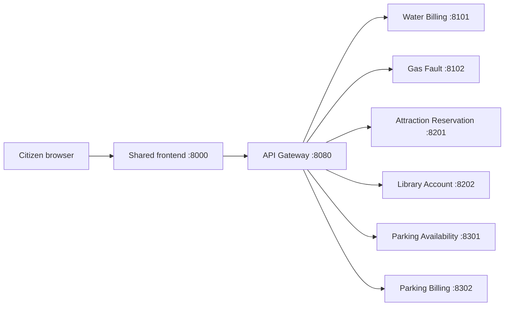

# ServiceUniverse 架构说明

## 1. Service 与 Microservice 的区别

课程课件 *Service-oriented architectural patterns — Microservices* 对两者的定义是：

- Software Service 通过公开接口被远程访问，内部实现对调用者隐藏。
- Microservice 在此基础上还强调小粒度、单一职责、自包含、独立数据和独立部署。
- 良好的 Microservice 应高内聚、低耦合，使用轻量通信，并对应业务能力。

因此本项目统一采用以下口径：

1. 平台共有 **6 项业务服务**，六项都需要可执行代码和 HTTP 接口。
2. Part E 选定 **3 项重点微服务**：Water Billing、Attraction Reservation 和
   Parking Availability。
3. 另外三项仍是可执行的业务服务，但可以采用相对简化的设计与部署。

开发阶段使用 Compose 将六项服务运行在不同进程中，是为了方便集成；这件事本身
不能证明六项都满足完整的 Microservice 要求。

## 2. 三项重点微服务的验收条件

每项重点微服务必须具备：

- 清晰且集中的业务能力；
- 独立应用配置；
- 独立数据库或数据存储；
- 不导入其他服务源码；
- 不读取其他服务数据库；
- 最终交付前拥有服务自己的 Dockerfile 和依赖声明；
- 健康检查和自动化测试；
- 明确的 API 契约；
- 可以独立构建、启动、停止、测试和演示；
- 在共享前端外壳内拥有服务专属 UI 代码。

## 3. 运行结构

浏览器的业务数据请求只调用 Gateway。初始化阶段暴露六个服务端口，仅用于开发、
查看 OpenAPI 和独立测试。

## 4. 通信决策

- 外部风格：HTTP REST + JSON。
- 当前交互：同步请求/响应。
- 协调方式：Gateway 提供公共入口和错误转换，但不包含业务逻辑。
- 地址发现：环境变量。
- 请求追踪：`X-Request-ID`。
- 故障处理：明确超时，并统一转换为 `502`、`503` 或 `504`。
- 共享数据库：禁止。

只有真实流程需要时才引入异步消息或 Message Broker，不为了让架构看起来复杂而增加。

## 5. 信息来源

- `contracts/catalog.json`：Provider、Service、slug、负责人、端口与重点微服务标记。
- `API_CONVENTION.md`：全平台 HTTP 与 JSON 规则。
- `contracts/schemas/`：各服务 OpenAPI 或 JSON Schema。
- `.env.example`：宿主机开发地址。
- `compose.yaml`：容器地址与启动关系。

修改 slug、端口、字段、状态或活动名称时，必须先修改相应信息来源，并在 PR 中
说明影响。

## 6. 共享前端边界

前端提供统一品牌、导航、可访问性和错误语言。服务负责人只编辑：

- `frontend/templates/services/<service-slug>.html`；
- 必要的服务专属 CSS/JavaScript；
- 对应页面测试。

公共模板和 `frontend/static/css/site.css` 由 Leader 维护，避免六项服务变成六套
互不相关的网站。

## 7. 开发镜像与最终部署

根目录 `Dockerfile` 是方便新成员一键启动的公共开发镜像。最终提交前，三项重点
微服务需要分别建立自己的 Dockerfile 和依赖边界，以证明它们可以独立部署。
