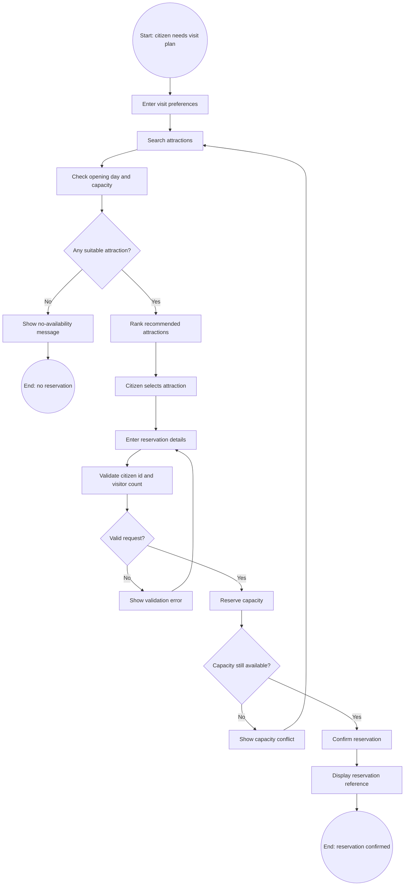

# Attraction Recommendation and Reservation - BPMN And Semantic Effects

Owner: Member C

## Source Basis

The process model is based on public timed-entry reservation practices:

- [National Archives Museum - Tickets](https://visit.archives.gov/visit/tickets)
  explains that the booking system shows real-time availability for dates and
  entry time slots, and visitors receive an e-ticket by email or text after
  booking.
- [The Broad - Know Before You Go & FAQ](https://www.thebroad.org/visit/know-you-go-faq)
  states that timed tickets have entry times and that each visitor may reserve
  only a limited number of tickets at a time.
- [Smithsonian NMAAHC - Plan Your Visit](https://nmaahc.si.edu/visit/plan-your-visit)
  states that entry is subject to building capacity and that individuals can
  reserve a limited number of timed-entry passes.

These sources justify the model's availability check, visitor-count limit,
capacity conflict branch, and reservation confirmation outcome.

## BPMN Text Model



## Activity Dictionary

| ID | BPMN activity | Implementation trace |
|---|---|---|
| A1 | Enter visit preferences | Frontend search form |
| A2 | Search attractions | `GET /api/v1/attractions` |
| A3 | Check opening day and capacity | `ensure_available`, `remaining_capacity` |
| A4 | Rank recommended attractions | `recommendation_score` sorting |
| A5 | Enter reservation details | Frontend reservation form |
| A6 | Validate citizen id and visitor count | Pydantic request validation |
| A7 | Reserve capacity | `create_reservation` active reservation check |
| A8 | Confirm reservation | Reservation status set to `confirmed` |
| A9 | Display reservation reference | Frontend confirmation message |

## Semantic Effect Annotations

Notation:

- `Pref(c, d, n, f)` means citizen `c` submitted preferences for date `d`,
  visitor count `n`, and filter set `f`.
- `Open(a, d)` means attraction `a` is open on date `d`.
- `Remaining(a, d, r)` means attraction `a` has remaining capacity `r` on date
  `d`.
- `Recommended(c, a)` means attraction `a` is recommended to citizen `c`.
- `Reservation(x, c, a, d, n, s)` means reservation `x` belongs to citizen `c`
  for attraction `a`, date `d`, visitor count `n`, and status `s`.

| Node | Direct effect in English | First-order logic effect |
|---|---|---|
| A1 | The citizen's visit preferences are known by the system. | `Pref(c, d, n, f)` |
| A2 | Candidate attractions matching basic filters are retrieved. | `Candidate(a, f)` |
| A3 | Closed or full attractions are excluded. | `Candidate(a, f) ∧ Open(a, d) ∧ Remaining(a, d, r) ∧ r >= n -> Available(a, d, n)` |
| G1 no | No available attraction exists for the submitted request. | `¬∃a Available(a, d, n)` |
| A4 | Available attractions are ranked as recommendations. | `Available(a, d, n) -> Recommended(c, a)` |
| A6 | Reservation input satisfies identity and visitor-count constraints. | `ValidCitizen(c) ∧ 1 <= n ∧ n <= 10 -> ValidRequest(c, n)` |
| G2 no | The reservation request is rejected before capacity is reserved. | `¬ValidRequest(c, n) -> Rejected(request)` |
| A7 | Capacity is reserved for a valid request when capacity remains. | `ValidRequest(c, n) ∧ Remaining(a, d, r) ∧ r >= n -> CapacityHeld(a, d, n)` |
| G3 no | The request conflicts with current remaining capacity. | `Remaining(a, d, r) ∧ r < n -> CapacityConflict(a, d, n)` |
| A8 | A confirmed reservation is created. | `CapacityHeld(a, d, n) -> ∃x Reservation(x, c, a, d, n, confirmed)` |
| A9 | The citizen receives a reservation reference. | `Reservation(x, c, a, d, n, confirmed) -> ReferenceShown(c, x)` |

## Cumulative Effect Scenarios

### Successful Reservation

English:

The citizen submits preferences, at least one attraction is open and has enough
capacity, the citizen selects one recommendation, the request passes validation,
capacity is still available, and a confirmed reservation reference is shown.

FOL:

```text
Pref(c,d,n,f)
∧ Candidate(a,f)
∧ Open(a,d)
∧ Remaining(a,d,r)
∧ r >= n
∧ ValidCitizen(c)
∧ 1 <= n ∧ n <= 10
-> ∃x Reservation(x,c,a,d,n,confirmed) ∧ ReferenceShown(c,x)
```

### No Suitable Attraction

English:

The citizen submits preferences, but no candidate attraction is both open and
able to fit the requested visitor count, so no reservation is created.

FOL:

```text
Pref(c,d,n,f)
∧ ¬∃a Available(a,d,n)
-> NoAvailabilityMessage(c) ∧ ¬∃x Reservation(x,c,a,d,n,confirmed)
```

### Capacity Conflict

English:

The citizen selects an attraction from a previous recommendation, but capacity
changes before confirmation. The system rejects the reservation and asks the
citizen to search again.

FOL:

```text
Recommended(c,a)
∧ Remaining(a,d,r)
∧ r < n
-> CapacityConflict(a,d,n) ∧ ¬∃x Reservation(x,c,a,d,n,confirmed)
```
