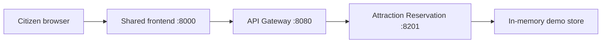

# Attraction Reservation Microservice Design

Owner: Member C

## Responsibility

The Attraction Recommendation and Reservation microservice owns one cohesive
business capability: helping a citizen choose an attraction and reserve a visit
when policy and capacity constraints allow it.

It does not implement library, parking, water, or gas-fault behavior, and it
does not import other service modules.

## Runtime Boundary



Current prototype storage is deterministic in-memory data so the course demo can
run from a clean clone. The production extension point is a service-owned
database table for attractions and reservations.

## API Surface

| Method | Path | Purpose |
|---|---|---|
| `GET` | `/api/v1/attractions` | Filter and recommend attractions. |
| `POST` | `/api/v1/reservations` | Create a reservation when capacity is available. |
| `GET` | `/api/v1/reservations/{reservation_id}` | Retrieve reservation details. |
| `PATCH` | `/api/v1/reservations/{reservation_id}/status` | Apply legal reservation status transitions. |

The public browser path goes through the Gateway. The downstream service returns
strongly typed domain JSON; the Gateway wraps it in the shared platform response
envelope.

## Data Model

Attraction:

- `attraction_id`
- `name`
- `category`
- `district`
- `indoor`
- `tags`
- `rating`
- `capacity_per_day`
- `open_days`
- `description`

Reservation:

- `reservation_id`
- `attraction_id`
- `citizen_id`
- `visit_date`
- `visitor_count`
- `status`
- `contact_phone`

## Business Rules

- A reservation can include 1 to 10 visitors.
- A reservation can be created only for a known attraction.
- The attraction must be open on the visit date.
- Active reservations reduce remaining capacity.
- Capacity conflicts return `409 Conflict`.
- Status transitions are restricted to the documented state machine.

## Independent Deployment Evidence

- Service module: `services/attraction_reservation/app/main.py`
- Service Dockerfile: `services/attraction_reservation/Dockerfile`
- Port: `8201`
- Health check: `GET /health`
- Contract: `contracts/schemas/attraction-reservation.openapi.yaml`
- Tests: `services/attraction_reservation/tests/test_attraction_reservation.py`

## Verification

```bash
python -m ruff check .
python -m pytest
python scripts/smoke_test.py
```

Docker Compose validation still depends on the local machine having Docker
available in `PATH`.
