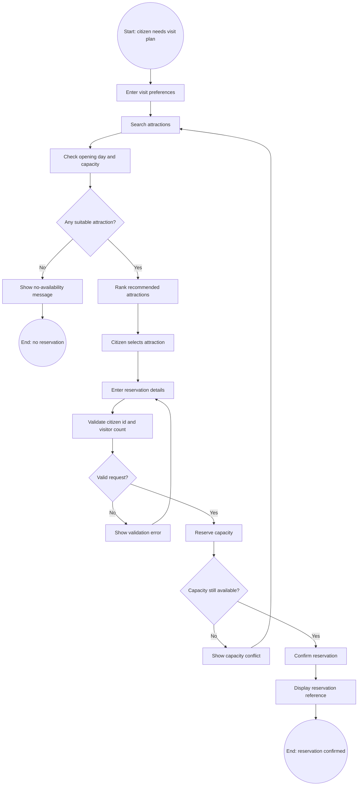
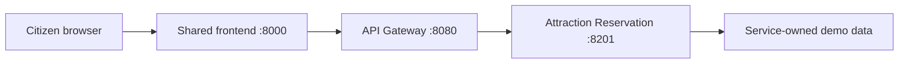

# 成员 C 报告章节草稿

负责人：成员 C  
负责服务：Attraction Recommendation and Reservation Service  
所属服务提供者：Municipal Culture & Recreation Services

## 1. 服务识别与说明

Attraction Recommendation and Reservation Service 面向市民提供景点推荐与预约能力。
市民可以根据访问日期、人数、区域和景点类别输入偏好，系统返回仍有容量且符合开放日
规则的景点，并允许市民创建预约。该服务属于项目选定的三项重点微服务之一，因此不仅
提供 HTTP 接口，还需要具备独立的业务边界、契约、测试、部署说明和前端交互页面。

该服务由 Municipal Culture & Recreation Services 提供，通过 ServiceUniverse 的共享
Frontend 和 API Gateway 对外暴露。浏览器端不会直接访问服务端口，而是通过 Gateway
访问公共 API。Gateway 负责请求标识、下游转发和统一响应格式，具体业务规则保留在
Attraction Reservation 微服务内部。

## 2. BSRL 服务说明

### 2.1 服务参与者

| 参与者 | 角色 | 职责 |
|---|---|---|
| Citizen | 服务消费者 | 输入访问偏好、选择推荐景点、提交预约信息。 |
| Municipal Culture & Recreation Services | 服务提供者 | 发布景点、开放日、容量和预约规则。 |
| Attraction Reservation Microservice | 服务参与系统 | 校验开放日与容量，生成预约并维护预约状态。 |
| API Gateway | 服务中介 | 统一公共入口、请求转发、错误封装和请求追踪。 |

### 2.2 业务服务

```text
Business Service: AttractionRecommendationAndReservation
Provider: MunicipalCultureAndRecreationServices
Consumer: Citizen
```

该业务服务包含两个核心能力：

1. `RecommendAttractions`：根据访问日期、访问人数、区域、类别、室内外偏好和评分等
   条件筛选景点，并按照推荐分排序。
2. `ReserveAttractionVisit`：在景点存在、开放且容量充足时创建预约，并返回预约编号。

### 2.3 服务契约

推荐景点请求包含：

- `visit_date`
- `visitor_count`
- `district`
- `category`
- `indoor`
- `min_rating`
- `recommend`

推荐景点响应包含：

- 景点基本信息；
- 当日剩余容量 `available_capacity`；
- 推荐评分 `recommendation_score`。

创建预约请求包含：

- `attraction_id`
- `citizen_id`
- `visit_date`
- `visitor_count`
- `contact_phone`

创建预约响应包含：

- `reservation_id`
- `attraction_id`
- `citizen_id`
- `visit_date`
- `visitor_count`
- `status`

## 3. 业务规则与状态

服务实现中使用以下业务规则：

- 只能为已存在的景点创建预约；
- 预约日期必须是景点开放日；
- 单次预约人数限制为 1 到 10；
- 同一天同一景点的 active reservation 会占用容量；
- 如果剩余容量不足，返回 `CAPACITY_CONFLICT`；
- 预约创建后进入 `confirmed` 状态；
- 预约状态只能按照允许的状态机转换。

预约状态机如下：

```text
pending -> confirmed
pending -> cancelled
confirmed -> completed
confirmed -> cancelled
completed -> terminal
cancelled -> terminal
```

主要错误码：

| 错误码 | 含义 |
|---|---|
| `ATTRACTION_NOT_FOUND` | 请求的景点不存在。 |
| `ATTRACTION_CLOSED` | 景点在请求日期不开放。 |
| `CAPACITY_CONFLICT` | 剩余容量不足。 |
| `RESERVATION_NOT_FOUND` | 请求的预约不存在。 |
| `INVALID_RESERVATION_STATUS` | 请求的状态转换不合法。 |

## 4. BPMN 流程设计

该 BPMN 流程参考公开景点或博物馆 timed-entry reservation 的实际规则：系统会显示
可用日期或入场时段，预约成功后生成确认凭证，同时每名访客的预约数量和场馆容量通常
受到限制。基于这些规则，本服务流程重点体现偏好输入、可用性检查、容量冲突处理和预约
确认。



流程中的主要网关包括：

- `Any suitable attraction?`：判断是否存在符合开放日和容量约束的景点；
- `Valid request?`：判断预约输入是否满足身份和人数约束；
- `Capacity still available?`：处理推荐之后、确认之前容量发生变化的冲突情况。

## 5. 语义效果标注

### 5.1 谓词定义

| 谓词 | 含义 |
|---|---|
| `Pref(c,d,n,f)` | 市民 `c` 提交了日期 `d`、人数 `n` 和筛选条件 `f`。 |
| `Candidate(a,f)` | 景点 `a` 满足基础筛选条件 `f`。 |
| `Open(a,d)` | 景点 `a` 在日期 `d` 开放。 |
| `Remaining(a,d,r)` | 景点 `a` 在日期 `d` 剩余容量为 `r`。 |
| `Available(a,d,n)` | 景点 `a` 可容纳日期 `d` 的 `n` 名访客。 |
| `Recommended(c,a)` | 景点 `a` 被推荐给市民 `c`。 |
| `ValidRequest(c,n)` | 市民和人数输入满足预约规则。 |
| `Reservation(x,c,a,d,n,s)` | 预约 `x` 属于市民 `c`，景点为 `a`，日期为 `d`，人数为 `n`，状态为 `s`。 |

### 5.2 直接效果

| BPMN 节点 | 英文直接效果 | 一阶逻辑标注 |
|---|---|---|
| Enter visit preferences | The citizen's visit preferences are captured. | `Pref(c,d,n,f)` |
| Search attractions | Attractions matching basic filters are retrieved. | `Candidate(a,f)` |
| Check opening day and capacity | The service excludes closed or full attractions. | `Candidate(a,f) ∧ Open(a,d) ∧ Remaining(a,d,r) ∧ r >= n -> Available(a,d,n)` |
| Rank recommended attractions | Available attractions become ranked recommendations. | `Available(a,d,n) -> Recommended(c,a)` |
| Validate citizen id and visitor count | The request satisfies identity and visitor-count constraints. | `ValidCitizen(c) ∧ 1 <= n ∧ n <= 10 -> ValidRequest(c,n)` |
| Reserve capacity | Capacity is held for a valid request. | `ValidRequest(c,n) ∧ Remaining(a,d,r) ∧ r >= n -> CapacityHeld(a,d,n)` |
| Confirm reservation | A confirmed reservation is created. | `CapacityHeld(a,d,n) -> ∃x Reservation(x,c,a,d,n,confirmed)` |
| Display reservation reference | The citizen receives a reservation reference. | `Reservation(x,c,a,d,n,confirmed) -> ReferenceShown(c,x)` |

### 5.3 累积效果场景

成功预约场景：

```text
Pref(c,d,n,f)
∧ Candidate(a,f)
∧ Open(a,d)
∧ Remaining(a,d,r)
∧ r >= n
∧ ValidCitizen(c)
∧ 1 <= n ∧ n <= 10
-> ∃x Reservation(x,c,a,d,n,confirmed) ∧ ReferenceShown(c,x)
```

无可用景点场景：

```text
Pref(c,d,n,f)
∧ ¬∃a Available(a,d,n)
-> NoAvailabilityMessage(c) ∧ ¬∃x Reservation(x,c,a,d,n,confirmed)
```

容量冲突场景：

```text
Recommended(c,a)
∧ Remaining(a,d,r)
∧ r < n
-> CapacityConflict(a,d,n) ∧ ¬∃x Reservation(x,c,a,d,n,confirmed)
```

## 6. 微服务设计与实现

Attraction Reservation 被设计为高内聚、单一职责的微服务。其职责集中在景点推荐和预约
确认，不处理停车、图书馆、水费或燃气故障等其他业务。服务实现位于
`services/attraction_reservation/`，通过 FastAPI 暴露接口，并使用 Pydantic 对请求和响应
进行验证。

运行结构如下：



当前原型使用可重复的内置演示数据，以保证从干净 clone 中可以直接运行和测试。未来生产化
版本可以将景点和预约迁移到该服务独立拥有的数据库，但仍应保持服务数据边界，不直接读取
其他服务的数据存储。

实现证据：

- 服务实现：`services/attraction_reservation/app/main.py`
- Gateway 路由：`gateway/app/routers/attraction_reservation.py`
- 前端页面：`frontend/templates/services/attraction-reservation.html`
- API 契约：`contracts/schemas/attraction-reservation.openapi.yaml`
- 服务 Dockerfile：`services/attraction_reservation/Dockerfile`
- 单元测试：`services/attraction_reservation/tests/test_attraction_reservation.py`

## 7. Parking Billing 流程分析任务

C 还负责 Parking Billing 的流程挖掘与分析。该任务依赖成员 E 提供冻结后的活动词典和原始
事件日志。为了不伪造数据，当前仓库先完成了分析框架：

- 输入 Schema 校验；
- 时间戳标准化；
- 事件按 case 和 timestamp 排序；
- 输出清洗后的 CSV；
- 输出 case 数、event 数、activity 数、variant 和 duration 摘要。

分析脚本：

```text
analytics/parking_billing/mining/analyze_parking_billing.py
```

运行方式：

```bash
python analytics/parking_billing/mining/analyze_parking_billing.py \
  analytics/parking_billing/event_logs/<raw-log>.csv
```

当 E 提供原始日志后，C 将把输出摘要用于报告中的流程发现、路径变体、一致性和性能分析
解释。当前阶段不能声称已经得到真实 Parking Billing 的挖掘结论，因为原始日志尚未进入仓库。

## 8. 验证结果

当前 C 分支已经完成以下验证：

```text
python -m ruff check .
python -m pytest
python scripts/smoke_test.py
```

已验证内容包括：

- C 服务健康检查；
- 景点推荐正常路径；
- 预约创建与查询；
- 容量冲突；
- 非法状态转换；
- Gateway 转发；
- 共享前端页面可访问；
- Parking Billing 分析脚本的输入校验和摘要输出。

Docker Compose 验证依赖本地安装 Docker CLI。若评审机器已经安装 Docker Desktop，可继续运行：

```bash
docker compose config
docker compose up --build
python scripts/smoke_test.py
```

## 9. 已知限制

- 演示数据当前存放在服务内存中，适合课程原型和自动化测试，不代表生产数据库设计已经完成。
- Parking Billing 的真实流程挖掘结论等待成员 E 提供原始事件日志后补齐。
- 最终报告中的图形化 BPMN 图可由本文 Mermaid 流程转绘为正式 BPMN 2.0 图。
